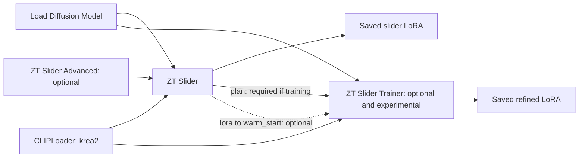

# ComfyUI-ZeroTrain-Slider

**Turn a pair of concept descriptions into a reusable slider LoRA inside ComfyUI.**

Build an axis such as young ↔ old, muted ↔ vivid colour, or close-up ↔ wide shot. Load the saved LoRA in your generation workflow and adjust its strength to explore the two directions.

The first stage solves a weight update without gradient training. An optional, experimental second stage attempts refinement with gradient training. Both use the model's own responses to text; neither requires a folder of training images.

**Included model backend: Krea 2 (K2).** Other architectures require a backend implementation. A model appearing in ComfyUI's loader does not mean this node supports it.

## Important: expectations and experimental features

**Zero-training works best for relatively simple concepts the model already understands**, such as photorealistic ↔ anime appearance, adding detail, or changing colour and lighting. These are example targets, not guaranteed successes. Complex concepts and combinations of attributes can exceed what the closed-form edit can express; some will not work even with tuning. Higher weight cannot create a concept direction the edit did not capture. Realistic ↔ anime is an example custom axis, not a separately named built-in preset.

**There is no universal LoRA loading weight.** In the author's experiments, some sliders work around `+2` or `-2`, while others need around `+20` or `-20` to show a useful effect. The suitable range depends on the model, concept and resulting LoRA. Start low and increase gradually while comparing fixed-seed images. ±2 is a starting point, not a hard limit; ±20 is an observed example, not a recommended default or maximum. Stop increasing if distortion grows without improving the intended concept.

**The trainer is optional and experimental, and the `lora` → `warm_start` connection is entirely optional.** You can use the solver's saved LoRA directly without running the trainer. If you try the trainer, connect this wire only to initialise it from the solved weights; leave it disconnected to train from zero. The trainer still requires `plan`, MODEL and CLIP. Experimental refinement is not guaranteed to improve the slider or solve a complex concept.

**The author's separate weight-baking tool is not included.** The author sometimes uses that tool for sliders needing a large loading multiplier and may publish it later. This node's existing construction-strength and automatic-scaling controls are distinct from that separate utility. It is not required to use the saved LoRA with a suitable loading strength.

## Documentation

| Start here | What you will find |
|---|---|
| [User guide](docs/USER_GUIDE.md) | Installation, first run, generation, custom concepts, saving and sharing |
| [All settings](docs/NODE_REFERENCE.md) | Every node input and output, defaults, ranges and tuning advice |
| [How it works](docs/HOW_IT_WORKS.md) | Solver mathematics, calibration and the optional trainer |
| [Troubleshooting and FAQ](docs/TROUBLESHOOTING.md) | Missing nodes, memory, weak sliders, reports and limitations |
| [Adding a model](ADDING_A_MODEL.md) | Backend contract and validation requirements |
| [Publishing on GitHub](docs/PUBLISHING.md) | Maintainer setup, release checks and optional Registry publication |

## What is included?

| Stage | Method | Output | Main cost |
|---|---|---|---|
| ZT Slider | Closed-form text-conditioning edit; no optimiser or backward pass | Slider LoRA, plan and diagnostic report | Text encoding, covariance solve; full denoiser passes if verification is enabled |
| ZT Slider Trainer | Optional, experimental training from the solved LoRA or from zero | One refined adapter file and a loss report | Frozen target generation plus forward/backward passes |

Five nodes appear under `training/zero-train slider`: **ZT Slider (Zero-Training LoRA)**, **ZT Slider Advanced**, **ZT Slider Info / Backends**, **ZT Slider Trainer (warm start)** and **ZT Slider Train Advanced**.

## Install

Place this complete repository folder in the `custom_nodes` directory of the ComfyUI installation you actually run, then restart ComfyUI. Include `zt_backends/`; copying only the top-level Python files is insufficient. This follows ComfyUI's [manual custom-node installation procedure](https://docs.comfy.org/installation/install_custom_node).

Use a ComfyUI build with Krea 2 support and the training/weight-adapter APIs this package imports. `pyproject.toml` declares no additional dependencies, but ComfyUI, PyTorch and safetensors are required through the host environment. A tested minimum ComfyUI version has not yet been recorded. See the [compatibility notes](docs/USER_GUIDE.md).

## First slider

1. Start with a working Krea 2 installation and its matching Qwen3-VL-4B text encoder.
2. Load [example_workflow.json](example_workflow.json) into ComfyUI. Select your actual diffusion and text-encoder files; set the CLIP loader type to `krea2`.
3. For your first run, mute the trainer and its downstream report/loss display nodes. The supplied workflow otherwise enables both stages.
4. Choose a concept. Start with `scenes = 40`, `rank = 16`, `strength = 1.0`, `verify = true` and `auto_save = true`.
5. Run and read the solver report. Copy its `saved_path` if you need to locate the file.
6. In a working Krea 2 image-generation workflow, load that file with **Load LoRA (Model Only)** (`LoraLoaderModelOnly`). Feed its MODEL output to your sampler.
7. Keep the prompt, seed and generation settings fixed. Compare strengths `-1`, `0` and `+1`, then try `-2` and `+2`. Increase gradually if needed; some of the author's sliders require around ±20. Use the lowest useful weight.

The supplied workflow builds LoRAs and shows diagnostics; it is not an image-generation or strength-grid workflow. Use your normal model-compatible VAE and sampler setup to inspect images.

## Reading the result

`image_effect` measures agreement between the LoRA's change to denoiser predictions and the positive/negative prompt difference. It is a useful diagnostic, **not an image-quality score or proof that a concept works on every prompt**.

Check it alongside `size vs prompt`, key binding and a same-seed image comparison. Verification may correct the saved weights' sign, but the displayed candidate metrics describe the measurements before that correction. A skipped or failed verification is not a verified success.

Strength zero is the baseline. Positive strength is intended to move toward the positive phrase; negative strength toward the negative phrase. Calibration estimates a useful scale on a small probe set. It does not guarantee that strength 1 produces the same image as appending the phrase.

## Capabilities and limits

The 15 presets cover age, body weight, muscularity, expression, hair length, detail, lighting, depth of field, camera distance, colour, broad rendering style, weather, time of day, surface wear and crowding. Custom prompt pairs are also supported.

This method reuses concepts the model already knows. It does not learn a new person's identity from photographs, guarantee anatomy or exact object counts, or reproduce an unseen style. Broad illustrated/photographic style changes are different from learning a new style. Training can reach additional denoiser layers, but still relies on the same model-generated text signal.

Runtime and memory depend on checkpoint precision, hardware, offloading and settings. No universal VRAM minimum, speed claim or success rate is established by the supplied code.

## Development and license

See [CONTRIBUTING.md](CONTRIBUTING.md) for useful bug reports and contribution checks. Package metadata currently declares **GPL-3.0-or-later**. The maintainer must include the corresponding full license text before release; see [publishing checklist](docs/PUBLISHING.md). Model weights have their own terms.

Documentation describes the supplied source snapshot (`pyproject.toml` version `3.0.1`). It is based on source inspection, not a new GPU benchmark or runtime certification.
