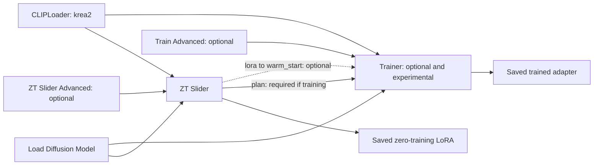

# ZeroTrain Slider for ComfyUI

**Build concept-slider LoRAs with a closed-form solve, then optionally check their effect against the real denoiser.**

The zero-training stage uses no optimiser and no gradients. It measures a concept from the model's own text conditioning and calculates a low-rank weight update. An **optional, experimental trainer** can then attempt further refinement.

**Included backend: Krea 2 (K2).** Neither stage needs an external image dataset. Other model architectures require a compatible backend implementation.

## What is a slider LoRA?

A slider LoRA is an adapter intended to move a model along a concept axis. You load the file and adjust its strength: negative values aim toward one end, positive values toward the other, and zero gives the baseline.

For example, an age slider may move a subject toward younger or older features. A detail slider may move between smoother surfaces and stronger fine detail. Both ordinary LoRAs and slider LoRAs have adjustable loading strengths; what makes a slider different is its intended positive/negative concept behaviour.

“Zero-training” describes how the first stage builds the adapter. Instead of updating weights through a gradient-descent loop, it solves a regularised least-squares problem and compresses the result into LoRA factors. It still performs model forward passes and numerical computation. Encoding, solving and optional verification all contribute to runtime.

## Important expectations

**Zero-training works best for simple concepts the model already understands**, such as photorealistic ↔ anime appearance, adding detail, or changing colour and lighting. These are examples, not guaranteed successes. Complex concepts and combinations of attributes may not work, even with tuning. Increasing the weight cannot add a concept direction the slider failed to capture. Realistic ↔ anime is an example custom axis, not a separate built-in preset.

**There is no universal LoRA loading weight.** In my experiments, some sliders work around `+2` or `-2`, while others need around `+20` or `-20`. The useful range depends on the model, concept and resulting LoRA. Start low and increase gradually while comparing images with the same seed. These values are examples, not fixed limits or recommended defaults. Stop increasing the weight if distortion grows without improving the intended effect.

**The trainer is optional and experimental. The `lora` → `warm_start` connection is also optional.** You can use the saved zero-training LoRA directly without running the trainer. If you try training, connect this wire to start from the solved weights, or leave it disconnected to train from zero. The trainer still requires `plan`, MODEL and CLIP. Refinement is not guaranteed to improve the slider or make a complex concept work.

**My separate weight-baking tool is not included.** I sometimes use it for sliders that need a large loading multiplier, and I may publish it later. It is separate from this node's construction-strength and automatic-scaling controls. You can still use the saved LoRA by adjusting its loading strength.

## Contents

- [Requirements](#requirements)
- [Installation](#installation)
- [First slider](#first-slider)
- [Using the saved LoRA](#using-the-saved-lora)
- [How the zero-training solve works](#how-the-zero-training-solve-works)
- [Why Krea 2 uses the text path](#why-krea-2-uses-the-text-path)
- [Verification and calibration](#verification-and-calibration)
- [Reading the report](#reading-the-report)
- [Optional experimental training](#optional-experimental-training)
- [Custom concepts and prompt selection](#custom-concepts-and-prompt-selection)
- [Settings and node reference](#settings-and-node-reference)
- [Troubleshooting](#troubleshooting)
- [Development and license](#development-and-license)

## Requirements

- A working ComfyUI installation with Krea 2 support and the training/weight-adapter APIs used by this package.
- A compatible Krea 2 checkpoint and its matching Qwen3-VL-4B text encoder, loaded with CLIP type `krea2`.
- Enough GPU memory and system RAM for the chosen checkpoint and operation. Verification runs the full denoiser; training adds backward-pass and optimiser costs.

The package declares no additional dependencies in `pyproject.toml`, but relies on the host's ComfyUI, PyTorch and safetensors environment. The optional `AdamW8bit` optimiser attempts to use bitsandbytes and falls back to AdamW when unavailable.

Both solver and trainer modules are imported at startup. Missing `comfy.weight_adapter`, bypass-adapter support or `comfy_extras.nodes_train` helpers can prevent the entire node pack from loading, even when you only want the solver.

A tested minimum ComfyUI version and comprehensive hardware/quantisation compatibility matrix have not yet been documented. The code supports working with ComfyUI-managed quantised weights, but this does not establish support for every third-party loader or format. Confirm that ordinary generation works with your model first.

No VAE is needed as an input to the solver or trainer. Your image-generation workflow still needs its normal compatible VAE to decode images.

## Installation

From the `custom_nodes` directory of the ComfyUI installation you actually run:

```shell
git clone https://github.com/aiartv1/ZeroTrain-Slider.git
```

Restart ComfyUI and search for **ZT Slider**. Nodes appear under `training/zero-train slider`.

Alternatively, download and extract the repository ZIP into `custom_nodes/ZeroTrain-Slider/`. The repository's `__init__.py` must sit directly inside that folder. Include the entire `zt_backends/` directory; copying only the top-level files is insufficient.

To update a Git installation, run `git pull --ff-only` inside this node's folder, then restart ComfyUI. Preserve local changes if Git reports conflicts. Avoid keeping multiple active copies of the same node pack.

## First slider

1. Open `example_workflow.json` from this repository in ComfyUI.
2. Re-select your actual diffusion and text-encoder files. Set the CLIP loader type to `krea2` and choose a diffusion-loader dtype appropriate to your checkpoint.
3. For a solver-only first run, mute the trainer and its downstream report/loss displays. The supplied example has both stages connected and enabled.
4. Choose a concept on **ZT Slider**. Start with `scenes = 40`, `rank = 16`, `strength = 1.0`, `verify = true` and `auto_save = true`.
5. Run the workflow, read the report and locate the file using `saved_path`.
6. Test the saved LoRA in a working Krea 2 generation workflow.

The example contains model loaders, both stages, Advanced nodes, report previews and a loss graph. It builds adapters; it does not generate a visual strength grid. Model weights are not bundled or downloaded by this node.

The example selects the Style concept and explicit style-related save names. Clear or change those names when choosing another concept.



## Using the saved LoRA

Load the `.safetensors` file with **Load LoRA (Model Only)** (`LoraLoaderModelOnly`). Feed its MODEL output into your sampling chain. Start with the same base checkpoint used to construct the slider.

The edit belongs to the diffusion model, even though the solver targets its text-conditioning path. It does not modify the separately loaded CLIP encoder. When using a general model+CLIP LoRA loader, leave CLIP strength at zero.

Use a neutral prompt that leaves the target attribute unspecified. Keep the seed, prompt, sampler, scheduler, guidance, steps and dimensions fixed. Compare `-1`, `0` and `+1`, then ±2. If the intended direction is present but weak, explore higher weights gradually. Some of my sliders need around ±20; use the lowest value that gives the effect you want.

No special trigger word is required. Positive strength is intended to follow the positive phrase and negative strength the negative phrase, but verify both visually. Very large strengths can alter unrelated details or distort the image.

The saver uses the **first configured LoRA directory**, usually `ComfyUI/models/loras/`, or falls back to ComfyUI's output directory if no LoRA directory is configured. It appends a timestamp and `.safetensors` extension to the sanitized save name. `saved_path` is authoritative. With auto-save off, the adapter remains on the live `LORA_MODEL` output and the path is empty.

## How the zero-training solve works

### 1. Ask the model about both ends of a concept

Each base scene is encoded three ways:

```text
Neutral:  a portrait of a person beside a window
Positive: a portrait of a person beside a window, elderly, aged features
Negative: a portrait of a person beside a window, youthful, unaged features
```

The positive and negative phrases are appended automatically. The backend runs the diffusion model's text-conditioning path and captures the chosen linear layers' inputs and outputs.

The target starts from **half the positive-minus-negative output difference**. It defines two directions around the neutral reference; it does not prove that the neutral output is the exact midpoint of the two extremes.

### 2. Measure two possible targets

| Objective | What is compared | Main tradeoff |
